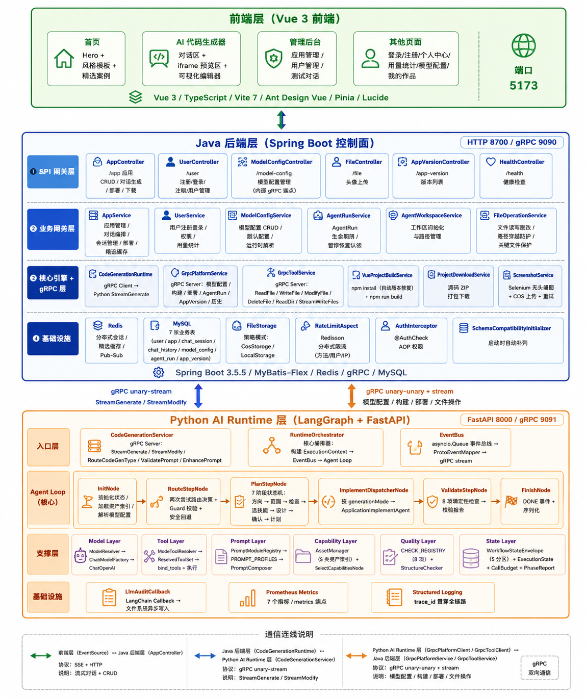
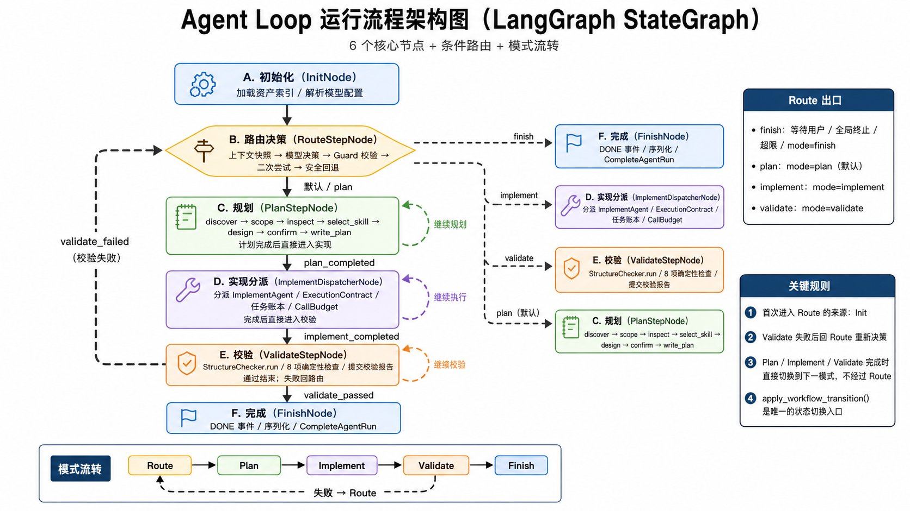

# AC AI Code Free — AI 智能编程辅助平台

基于 **Spring Boot 3 + Vue 3 + Python LangGraph** 分层架构的 AI 编程辅助平台。用户通过自然语言描述需求，AI 以 LangGraph StateGraph Agent Loop 模式自主完成需求分析、架构设计、代码生成、文件写入、构建部署全流程，实现"需求描述 → AI 智能体自主编程 → 实时预览 → 在线编辑 → 一键部署"全链路闭环。

---

## 完整技术栈

### Java 后端（控制面）

| 类别 | 技术 |
|------|------|
| 核心框架 | Spring Boot 3.5.5 / Java 17 |
| ORM | MyBatis-Flex 1.11.0 |
| 数据库 | MySQL 5.7+（HikariCP 连接池） |
| 缓存 | Redis + Redisson 3.45.1 + Caffeine |
| 分布式会话 | Spring Session Data Redis |
| gRPC | grpc-spring-boot-starter 3.1.0 / grpc 1.63.0 / protobuf 3.25.5 |
| 响应式 | Project Reactor（Flux / Sinks） |
| 文档 | Knife4j (Swagger) 4.4.0 |
| 对象存储 | 腾讯云 COS（可选，支持本地回退） |
| 截图 | Selenium 4.33.0 + WebDriverManager 6.1.0 |
| 工具库 | Hutool 5.8.38 / Lombok 1.18.38 |

### Python AI Runtime（执行面）

| 类别 | 技术 |
|------|------|
| 语言运行时 | Python 3.11+ |
| AI 编排 | LangGraph >= 0.2.0（StateGraph） |
| LLM 接口 | langchain-core >= 0.3.0 + langchain-openai >= 0.2.0 |
| Web 框架 | FastAPI >= 0.115.0 + uvicorn >= 0.30.0 |
| 数据验证 | Pydantic + pydantic-settings >= 2.8.0 |
| gRPC | grpcio + grpcio-tools >= 1.81.1 |
| 监控 | prometheus_client >= 0.20.0（/metrics 端点） |
| 代码质量 | ruff >= 0.6.0 |

### 前端

| 类别 | 技术 |
|------|------|
| 框架 | Vue 3（Composition API + `<script setup>`）|
| 语言 | TypeScript ~5.8.0 |
| 构建 | Vite ^7.0.6（HMR）|
| UI 库 | Ant Design Vue ^4.2.6（全站暗色主题，品牌绿 #22C55E）|
| 状态管理 | Pinia ^3.0.3 |
| 路由 | Vue Router ^4.5.1（自动发现路由文件）|
| HTTP | Axios ^1.11.0（Cookie 认证）|
| 图标 | Lucide Vue ^1.18.0 |
| API 生成 | @umijs/openapi ^1.14.1（Swagger → TS 自动生成）|
| 类型检查 | vue-tsc ^3.0.4 |
| E2E | Playwright ^1.60.0 |

---

## 系统架构



### 分层概述

```
┌──────────────────────┐      SSE / HTTP       ┌──────────────────────┐       gRPC 双向       ┌──────────────────────────┐
│   Vue 3 前端          │ ◄──────────────────► │  Java 后端            │ ◄───────────────────► │  Python AI Runtime       │
│  (Ant Design 暗色主题) │  EventSource + Axios  │  (Spring Boot 3.5.5)  │ 9090 ↔ 9091         │  (LangGraph + FastAPI)   │
│  端口 5173            │                       │  端口 8700 / 9090     │                       │  端口 8000 / 9091       │
└──────────────────────┘                       └──────────────────────┘                       └──────────────────────────┘
```

项目采用 **Java 控制面 + Python AI 执行面的严格分层架构**，所有 AI 核心能力强制在 Python 层实现，Java 仅保留平台控制和基础设施能力。

### Java 控制面职责

- **API 层**：12 个端点组（应用/用户/模型配置/会话/文件/健康），`@AuthCheck` 注解 AOP 权限
- **业务层**：AppService / UserService / ModelConfigService / AgentRunService / AgentWorkspaceService / FileOperationService
- **Core 层**：StreamHandlerExecutor（策略模式）、CodeParserExcutor、CodeFileSaverExecutor（模板方法）、VueProjectBuildService（npm install + build + 自动版本修复）
- **gRPC Server**（被 Python 调用）：GrpcPlatformService（10 个 RPC 方法：模型配置/构建/部署/AgentRun/AppVersion/聊天历史等）、GrpcToolService（6 个 RPC 方法：文件读写删改目录）、GrpcInternalAuthInterceptor 认证
- **gRPC Client**（调用 Python）：GrpcPythonAgentRuntime（StreamGenerate / StreamModify 等）
- **基础设施**：Selenium 截图 + COS 存储 + Redisson 分布式限流 + Schema 自动补列

### Python AI 执行面职责

所有 AI 核心能力。禁止在 Java 侧新增任何 AI 推理入口。

- **Agent Loop**（LangGraph StateGraph）：6 节点 × 4 模式循环编排
- **Prompt 系统**：7 Profile × 20+ 可组合 PromptModule
- **资产系统**：5 类文件驱动资产（Skill/Seed/Template/Design System/Craft）
- **工具系统**：ResolvedToolSet 三合一（模型绑定 + 摘要 + 执行），按模式分派权限
- **质量校验**：8 项确定性检查 + ArtifactManifest
- **状态系统**：V2 分区状态模型（5 分区 + PlanStage 状态机 + 写权限隔离）

### gRPC 通信协议（4 个 proto 文件）

| 方向 | 服务 | 方法 |
|------|------|------|
| Java → Python | CodeGenerationService | StreamGenerate（代码生成流）、StreamModify（代码修改流）、RouteCodeGenType（AI 路由）、ValidatePrompt（提示词校验）、EnhancePrompt（提示词增强） |
| Python → Java | PlatformService | GetModelConfig / ResolveRuntimeModelBundle / BuildVueProject / DeployApp / CompleteAgentRun / CreateAppVersion / GetChatHistory / UpdateAppCodeGenType / GetAppDetail / GetUserInfo |
| Python → Java | ToolService | ReadFile / WriteFile / ModifyFile / DeleteFile / ReadDir / StreamWriteFiles |

所有 gRPC 调用携带 `x-internal-secret` metadata 认证。

---

## AI Agent Loop 核心架构



### 图结构

正常路径（plan → implement → validate → finish 链式前进，**不经过 Route**）：

```
Init → RouteStep → PlanStep → ImplementStep → ValidateStep → Finish
                       ↑            │                │
                       │            │ (replan)       │ (failed)
                       │            ▼                ▼
                       └────── RouteStep (重新决策方向)
```

RouteStepNode **仅在以下两类场景进入**：
1. init → RouteStep（首次进入时选择初始模式）
2. validate_step 校验失败时（`route_after_validate_step` → "route_step"）

Plan 完成后直接进入 Implement，Implement 完成后直接进入 Validate，Validate 通过后直接 Finish，均不经过 Route。

### 四模式职责

| 模式 | 工具权限 | 职责 |
|------|---------|------|
| **Route** | 只读 + decide_route | 路由决策节点，仅用于初始分配和方向变更。两次尝试协议 + Guard 校验 + 安全回退 |
| **Plan** | 只读 + 提问 + 写计划文件 | 7 阶段严格状态机：direction → scope → inspect → select_skill → design → confirm → write_plan |
| **Implement** | 完整读写 + 终端命令 | 按 generationMode 分派 ImplementAgent。消费 ExecutionContract（三类来源归一化）。任务账本 + 动态调用预算 |
| **Validate** | 只读 + run_checks | 8 项确定性检查 → 结构化校验报告 → passed/failed。不依赖 LLM |

### 状态流转

```
PlanStepNode.apply_exit_transition():
  plan_just_finished → apply_workflow_transition(source="plan", target="implement")
                   → graph 条件边: route_after_plan_step → "implement_step"

ImplementDispatcherNode.apply_exit_transition():
  implement_just_finished + replan → apply_workflow_transition(source="implement", target="route")
                                   → _cleanup_phase_flags() 清除 implement_replan_requested
                                   → graph 条件边: route_after_implement_step 读到 replan=False → "validate_step"
  implement_just_finished + normal → apply_workflow_transition(source="implement", target="validate")
                                   → graph 条件边: route_after_implement_step → "validate_step"

ValidateStepNode.apply_exit_transition():
  validate_just_finished + passed → apply_workflow_transition(source="validate", target="finished")
                                  → graph 条件边: route_after_validate_step → "finish"
  validate_just_finished + failed → apply_workflow_transition(source="validate", target="route")
                                  → graph 条件边: route_after_validate_step → "route_step"
```

### 关键设计

- `apply_workflow_transition()` 是实际更改 `state.mode` 的函数，所有节点（Plan/Implement/Validate）完成时通过它直接切换目标模式。RouteStepNode 通过 `apply_route_decision()` → `apply_workflow_transition(reason_code="route_decision")` 更改模式。
- `ResolvedToolSet` 同一集合同时用于 `bind_tools()`、动态工具摘要、执行权限校验
- `TransitionGuard` 仅 RouteStepNode 中使用，基于 RouteContext 校验路由决策合法性
- 写文件循环拦截：同一文件累计成功写入 ≥ 3 次自动阻止

### V2 状态模型

5 个独立分区，各自有写权限校验：

| 分区 | 核心字段 |
|------|---------|
| Plan | plan_stage（状态机）、requirement_brief、design_specification、implementation_plan、capability_bundle |
| Execution | files_touched、implement_phase_files、active_task_id、execution_tasks、call_budget |
| Validation | validate_iterations、validation_status、validation_issues |
| Routing | route_decided、route_decision、route_iterations |
| Conversation | conversation_messages |

支持序列化 → loopStateJson → MySQL 持久化，用于暂停/恢复场景。

---

## 资产系统（Capability System）

5 类基于文件系统的可插拔资产，启动时自动扫描发现，SelectCapabilitiesNode 在工作流初始化时完成选择，通过 PromptModule 注入 AI 上下文。

```
assets/
├── asset-manifest.json       # 总开关 + 默认配置
├── skills/                   # 编程技能指令（5个）
├── seeds/                    # 项目初始化骨架（1个）
├── templates/                # 代码结构参考（3个）
├── design-systems/           # UI 设计系统规范（5个）
└── craft/                    # 通用质量规则（6+个）
```

| 资产 | 存储格式 | 选择策略 | 作用 |
|------|---------|---------|------|
| **Skill** | `skills/<id>/SKILL.md`（YAML frontmatter + Markdown + references 目录） | Plan 阶段 choose_skill 工具 | 告诉模型在特定场景下如何工作。5 个：dashboard / landing-page / web-prototype / frontend-design / ui-ux-pro-max |
| **Seed** | `seeds/<id>/seed.json` + `files/` 目录 | code_gen_type 匹配（vue_project → vue-basic） | 项目初始化时复制骨架文件到工作区 |
| **Template** | `templates/<id>/template.json` + `files/` + `references/` | code_gen_type + default 匹配 | 提供布局文件、checklist 等参考 |
| **Design System** | `design-systems/<id>/manifest.json` + DESIGN.md + tokens.css | prompt hint → default → fallback | 注入颜色体系/字体/组件规则/使用说明 |
| **Craft** | `craft/<id>.md`（frontmatter + Markdown） | required → suggested → default 三级递进 + priority 排序 | 跨设计系统的质量规则：anti-ai-slop（7 条 P0 规则防 AI 默认风格）、state-coverage、color、typography、accessibility-baseline、laws-of-ux |

---

## Prompt 模块化系统

不将 Prompt 写死在代码中，通过模块化组合实现职责隔离：

- **PromptModule** 抽象基类 → **PromptModuleRegistry** 统一注册
- **PROMPT_PROFILES** 显式声明每个 Profile 的模块列表（7 个 Profile）
- **PromptComposer** 按 Profile 逐模块 render 组合
- **动态工具摘要**从 `ResolvedToolSet.args_schema.model_json_schema()` 自动生成

| Profile | 包含模块摘要 | 用途 |
|---------|------------|------|
| route_initial | runtime_boundary + safety + route_initial + tool_list + anti_roleplay | 首次路由 |
| route_after_plan | 同上 + route_after_plan | Plan 后重路由 |
| route_after_implement | 同上 + route_after_implement | Implement 后重路由 |
| route_after_validate | 同上 + route_after_validate | Validate 后重路由 |
| plan | + project_rules + plan_workflow + plan_spec + skill_context + task_context | 规划阶段 |
| implement | + project_rules + implement_workflow + validate_feedback + artifact_output_contract | 实现阶段 |
| validate | + project_rules + validate_workflow | 校验阶段 |

---

## 生成模式系统（Generation Mode）

将 Plan/Implement/Validate 三阶段的 Prompt 模块、Implement Agent 和产物格式绑定为原子注册单元。新增生成能力只需注册定义，不修改核心图结构。

当前唯一注册：**`application`** 模式
- implement_agent_factory：ApplicationImplementAgent（插件架构）
- supported_artifact_formats：web_single_file / web_multi_file / vue_project

---

## 全链路质量体系

Validate 节点执行 8 项确定性检查，不依赖 LLM 评估，结果写入 ArtifactManifest：

| 检查 | 严重度 | 说明 |
|------|--------|------|
| entry_exists | error | 入口文件是否存在 |
| supporting_files_exist | warning | 关联文件完整性 |
| non_empty_files | error | 文件内容 > 20 字符 |
| vue_app_structure | error | Vue 项目结构（App.vue / package.json / main.ts）|
| no_placeholder_text | warning | Metric A / Card N / Lorem ipsum / TODO |
| artifact_tags_removed | warning | `<artifact>` 标签残留 |
| ai_default_indigo | warning | AI 常见 indigo 色系检测 |
| vue_state_coverage | warning | loading/empty/error/retry 状态覆盖率 |

---

## 前端功能

12 个页面 / 11 个可复用组件 / 全站暗色主题

| 页面 | 功能 |
|------|------|
| 首页（`/`） | Hero + 5 种风格模板 + Bento Grid 6 功能 + 精选案例（响应式 3→2→1 列）|
| AI 代码生成器（`/app/generate/:id`） | **核心页面**：左聊天区（会话管理 + 消息列表 + 追问表单 + 计划确认 + 输入框）+ 右 iframe 预览（桌面/移动端切换 + 可视化编辑 + 版本历史）|
| 我的作品（`/app/my`） | 卡片网格 + IntersectionObserver 无限滚动 |
| 模型配置（`/model/config`） | 9 个预设供应商 + Temperature/MaxTokens 滑块 |
| 登录/注册 | 双栏品牌布局 + 表单校验 |
| 管理后台（3 页面） | 应用管理/用户管理/测试对话 |

### 可视化编辑器

- 通过 `postMessage` 向 iframe 注入 IIFE 脚本
- 元素悬浮高亮（蓝色虚线 `#1677ff`）+ 点击选中（绿色实线 `#52c41a`）
- CSS 选择器自动生成（标签 + 类 + nth-of-type，最多 8 层）
- 选中元素信息自动拼接到 prompt，实现"选中 + 修改 → 增量 AI 调用"

---

## 安全体系

| 层级 | 防护 |
|------|------|
| 网络层 | gRPC x-internal-secret metadata 认证 |
| 路径层 | normalize() + startsWith() 校验，路径穿越 = 不可恢复错误 |
| 文件层 | 关键配置文件（package.json / vite.config.* / src/main.*）禁止删除 |
| 命令层 | Shell 链接符拦截 + 白名单 + 只读/写模式分离 + 脚本目录限制 |
| API 层 | @AuthCheck 注解 + AOP + 应用所有者校验 |
| 限流层 | Redisson 分布式限流（方法/用户/IP 三级）|
| 注入层 | ValidatePrompt 注入检测 + RISK_REJECTION_PATTERNS |
| 工具层 | 写文件循环拦截（≥3 次阻止）+ ResolvedToolSet 权限 |
| 状态层 | 序列化敏感数据脱敏（apiKey / token 等）|

---

## 数据库设计（7 张表）

| 表 | 核心字段 |
|----|---------|
| user | userAccount, userPassword(加密), userRole, vipExpireTime, shareCode, inviteUser |
| app | appName, codeGenType, generationMode, styleTemplate, deployKey(6位唯一), priority(99=精选), isTestApp |
| chat_session | appId, userId, title, messageCount, modelName, lastMessageTime |
| chat_history | sessionId, seqNo, message(MEDIUMTEXT), messageType, inputTokens, outputTokens, latencyMs |
| model_config | provider, modelName, baseUrl, apiKeyCipher(加密), configVersion, enabled, isDefault |
| agent_run | appId, sessionId, runtime, status, workspacePath, loopStateJson(TEXT), latencyMs |
| app_version | appId, agentRunId, versionNo, sourcePath, buildPath |

全部雪花算法主键 + 逻辑删除（isDelete）+ 统一时间审计。

---

## 本地开发

三个服务均支持代码修改后自动热重载（DevTools / --reload / HMR），**严禁手动重启**。

```bash
# Java 后端（端口 8700 / gRPC 9090）
cd backend-java && mvn spring-boot:run

# Python AI Runtime（FastAPI 8000 / gRPC 9091）
cd agent-runtime-python && uvicorn app.main:app --reload --port 8000

# 前端（端口 5173）
cd frontend-vue && npm install && npm run dev
```

## 测试

```bash
# Python（全量单测 + lint）
cd agent-runtime-python && pytest && ruff check .

# Java
cd backend-java && mvn test

# 前端（类型检查 + lint）
cd frontend-vue && npm run type-check && npm run lint
```
