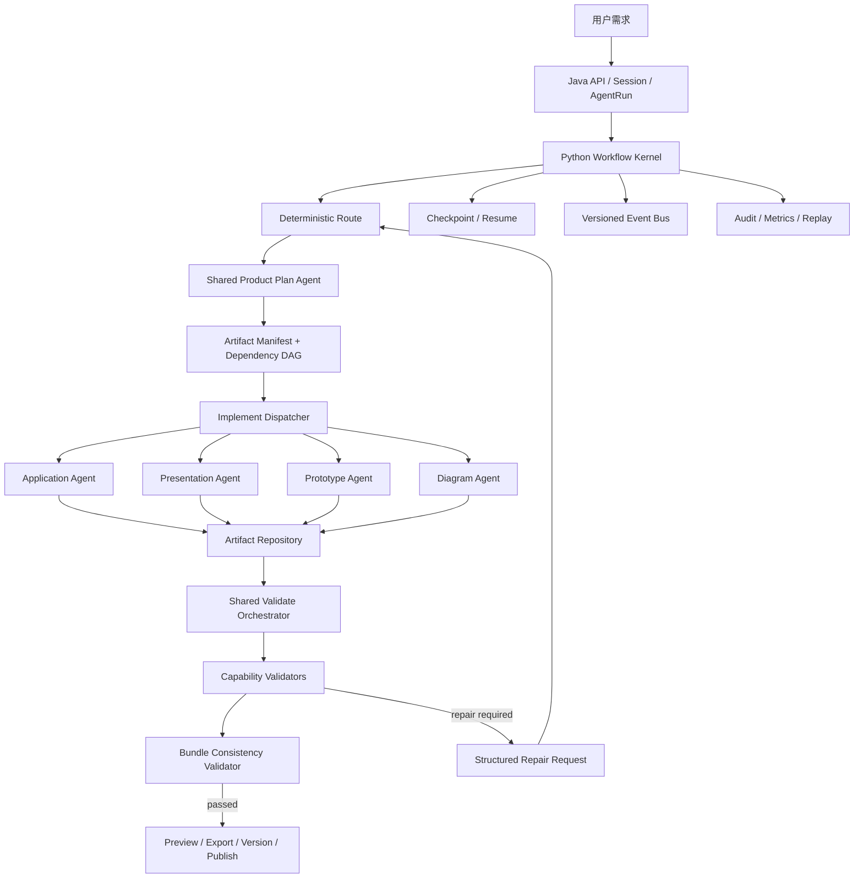

# 多产物、多智能体系统架构设计

## 1. 文档目的

本文档定义 `ac-ai-code-free` 从“AI 应用生成平台”扩展为“AI 产品设计与交付平台”前必须冻结的系统架构、协议边界和扩展规则。

目标能力包括但不限于：

- 应用生成；
- UI 界面原型设计；
- PPT 规划、设计、渲染与导出；
- 系统架构图生成；
- 系统流程图、业务流程图生成；
- 产品需求文档、设计说明等结构化产品文档；
- 一次需求生成多个相互依赖的产品设计产物。

本文档只定义架构设计，不授权直接修改运行时代码。后续实施必须另行编写阶段化 Implementation Plan。

## 2. 当前实现基线与扩展缺口

### 2.1 当前实现基线

本文档在 2026-06-22 以当前工作区代码为依据重新核对。当前 Python Agent Runtime 已经完成了多项 Agent Loop 基础收口，不应把历史修复记录误写为当前仍存在的 Bug：

- 已形成 `Route → Plan → Implement → Validate → Finish` 主流程；
- 已使用显式 Prompt Profile，Route、Plan、Implement、Validate 分别组合明确模块；
- 已由 `ModeToolResolver` 生成不可变 `ResolvedToolSet`，同一集合用于模型绑定、动态工具摘要和执行校验；
- 已将历史工具记录格式化为只读 `SystemMessage` 观察摘要，不再重建为可执行 `AIMessage.tool_calls` / `ToolMessage`；
- Route 已作为阶段流转提交入口，并已引入 transition guard、cycle/stagnation 检测和安全回退；
- 已存在版本化 `WorkflowStateEnvelope v2`、状态分区、revision、`PhaseCompletionReport` 和旧状态适配器；
- 已使用 `ArtifactTypeState` 统一当前应用代码生成类型的 requested/effective/recommended 语义；
- 暂停恢复时如果模型配置缺少 `apiKey` 等运行依赖，会重新解析完整模型配置；
- 工具调用失败会写入 `executed_tool_calls`，不会只剩日志文本；
- Validate 已有只读工具策略、执行层越权拒绝和结构化 ValidationReport；
- `ask_user` 的 Python 主链已折叠为单次结构化 TOOL_REQUEST，前端使用结构化 planning payload，同时保留旧 `<planning>` 标记兼容。

本轮针对上述边界运行了定向回归：117 passed。覆盖工具历史只读化、Validate 越权拒绝、Prompt/工具一致性、状态恢复、Route 所有权、进度检测、Transition Guard、失败工具记录和 ask_user 暂停恢复。

当前工作区同时存在尚未提交的 Agent Loop 演进代码。后续 Implementation Plan 开始前必须先锁定实际基线 commit，不能把“当前工作区存在”直接等同于“已进入稳定分支”。

### 2.2 面向多产物的真实扩展缺口

现有能力已经能支撑应用生成，但仍围绕“一个工作流生成一种应用代码产物”组织。以下是面向 PPT、原型和图表扩展时需要新增的架构能力，不是对当前应用生成链路的 Bug 判定：

- `codeGenType` 主要表达 HTML/Vue 工程形态，尚未形成通用 ArtifactKind / Capability 协议；
- Implement 仍是面向应用文件生成的统一节点，尚未形成专业 Agent Dispatcher；
- Validate 已实现只读和结构化报告，但校验器仍以应用代码和当前 Artifact 为中心；
- 单一 `ArtifactTypeState` 可以统一当前应用类型，但不能表达一个任务中的多 Artifact Manifest 和依赖 DAG；
- 当前工具观察摘要已经不可执行，但尚未形成不同专业 Agent 之间的显式 Scoped Handoff；
- 当前 workspace、构建、预览和部署能力主要服务应用源码，尚未抽象通用 Renderer / Exporter / Artifact Repository；
- 当前事件主路径已结构化，但前端仍保留部分历史展示兼容层，新增产物事件前需要冻结统一事件 Schema；
- 当前状态协议按 Plan/Execution/Validation/Routing 分区，但尚未定义多 Artifact 并发、lease、依赖失效传播和部分成功语义。

因此，扩展方向不是继续增加 `ppt_mode`、`prototype_mode`、`diagram_mode`，而是把以下三个维度彻底分离：

```text
AgentMode：当前处于哪个生命周期阶段
Capability：当前使用哪种专业生成能力
Artifact：当前处理哪个具体产物
```

## 3. 历史失效模式、当前状态与扩展守卫

历史文档只用于说明“为什么某项守卫必须保留”，不能据此断言问题当前仍存在。当前状态以现行代码和本轮回归为准。

| 历史失效模式 | 当前状态 | 多智能体扩展时必须保留或增强的守卫 |
| --- | --- | --- |
| Validate 看到 Implement 历史后尝试写入 | 已修复：工具历史为只读观察；Validate 的 resolver、policy 和执行入口均拒绝 `write_file` | 专业 Agent 间只传 Scoped Handoff；审计历史不得进入其他 Agent 的可执行上下文 |
| Route/Validate Prompt 出现写工具说明 | 已修复：显式 Profile + 动态工具摘要，并有 Prompt/Tool 一致性回归 | Capability Profile 继续显式列模块；工具摘要只来自同次 `ResolvedToolSet` |
| stale Route 决策导致 Plan/Implement 循环 | 已收口：Route 重置并重新决策，已有所有权、Guard 和进度检测 | 多 Artifact 调度必须带 revision、artifact_id 和 consumed signal，禁止复用 stale 决策 |
| 暂停恢复后模型配置不完整 | 已修复：恢复检测配置完整性并重新解析模型，已有集成回归 | Secret 继续不持久化；所有 Runtime Dependency 均需定义恢复重建策略 |
| codeGenType 多真相源 | 当前应用范围已通过 `ArtifactTypeState` 收口 | 扩展为 ArtifactManifest 后仍需区分 requested/effective/recommended，禁止 Capability 各自覆盖 |
| Python 写入目录与 Java 构建目录不一致 | 历史修复总结记录已修复；本轮未重新执行 Java/Python 构建 E2E | 新产物不得自行拼接路径，统一使用 Artifact Location 引用和跨语言契约测试 |
| ask_user 依赖多端文本拼装 | 主链已结构化；前端仍保留旧 `<planning>` 兼容输出 | 新协议不得继续增加文本语义；Human Interaction 使用版本化 payload 并逐步退出兼容层 |
| Validate 只有结构检查却被解释为交付校验 | 当前已加入结构化报告和执行/验证证据，但仍面向应用产物 | PPT、原型和图表分别定义 Render、Semantic、Bundle 校验级别，不能套用应用检查器 |
| 工具失败未进入历史状态 | 已修复：失败工具调用进入 `executed_tool_calls`，有回归覆盖 | 统一 ToolExecutionRecord 必须同时支持 success/error/retry/compensation |
| 工具结果盲截断导致重复调用 | 已修复：历史盲截断已移除；写文件正文仍按安全规则压缩 | 多 Agent 上下文使用引用和有元数据的摘要，禁止静默字符切片 |
| LangGraph 返回类型差异导致状态读取失败 | 历史链路已建立兼容访问 | Kernel 保留唯一图引擎适配边界，专业 Agent 不直接依赖 LangGraph 返回形态 |
| 同轮文本和 tool_calls 只保留其一 | 已修复，并有 streaming/内部文本回归 | 统一 ModelTurnResult 同时表达文本、工具请求、usage 和 finish reason |

## 4. 设计目标

1. 保留统一的 Route、Plan、Implement、Validate 生命周期。
2. Plan 和 Validate 使用共享 Agent 流程，并按 Capability 注入领域模块。
3. Implement 通过 Dispatcher 调用不同的专业 Agent。
4. 新增 Capability 时不修改 Workflow Kernel 主图。
5. Agent 间不共享可执行工具历史，不允许能力从历史消息泄漏。
6. 状态、工具、Prompt、事件和产物协议均版本化。
7. 支持一个任务生成多个有依赖关系的产物。
8. 支持暂停、恢复、重试、部分失败和人工确认。
9. 支持按产物独立校验及跨产物一致性校验。
10. 现有应用生成能力必须先迁移为参考 Capability，再接入新能力。

## 5. 非目标

- 本阶段不实现 PPT、原型或图表生成代码。
- 不把每个 Agent 拆成独立微服务。
- 不允许 Java 恢复 AI 推理职责。
- 不为每种产物复制独立的 Route/Plan/Validate 状态机。
- 不让 LLM 自由修改全局模式、状态 revision 或其他 Agent 的状态分区。
- 不通过自然语言、关键字或工具名称推断关键工作流状态。
- 不直接把二进制 PPTX、图片或预览 HTML 作为 Agent 间协议。

## 6. 总体架构



### 6.1 控制面与执行面

Java 继续负责：

- 用户、项目、会话、AgentRun、权限、并发串行；
- Artifact 元数据、版本、导出任务、发布记录；
- 文件存储、对象存储、构建、部署和需要 Java 环境的渲染；
- SSE/API 出口和 gRPC bridge。

Python 继续负责：

- Workflow Kernel；
- Capability 解析；
- Agent 调度；
- 模型调用与 Prompt 组合；
- 工具调用决策；
- Plan、Implement、Validate、Route 的 AI 语义判断；
- 结构化中间产物生成。

## 7. Workflow Kernel

Workflow Kernel 是唯一的流程控制层，负责：

- 状态读取、校验和提交；
- Capability 解析；
- Agent 调用和结果接收；
- 状态转移守卫；
- checkpoint 与恢复；
- 预算、超时、取消和重试；
- 事件发布；
- 幂等与并发控制；
- 审计和可重放记录。

专业 Agent 不得直接修改 Workflow Kernel 内部状态，只能返回结构化结果。

## 8. 生命周期与专业 Agent

### 8.1 生命周期保持不变

```text
Route → Plan → Route → Implement → Route → Validate → Route → Finish
```

`mode` 只表达生命周期，不表达产物种类。

### 8.2 Shared Plan Agent

Plan Agent 使用统一规划流程，并根据 `ResolvedCapabilityContext` 注入领域规划模块。

它负责：

- 形成 RequirementBrief；
- 明确目标用户、使用场景和验收条件；
- 选择或建议 Capability；
- 生成 ArtifactManifest；
- 生成产物依赖 DAG；
- 为每个产物生成 ArtifactTask；
- 识别需要用户确认的产品决策；
- 估算成本和风险。

Plan Agent 不负责生成最终产物。

### 8.3 Implement Dispatcher

Implement Dispatcher 是确定性调度器，不是自由推理 Agent。它根据 Artifact DAG：

1. 查找依赖已满足且状态为 pending 的 ArtifactTask；
2. 解析对应 Capability Profile；
3. 创建 AgentInvocation；
4. 调用专业 Implement Agent；
5. 将 AgentResult 提交给 Kernel；
6. 更新 Artifact revision 和依赖状态；
7. 对可并行任务进行受控并行调度。

### 8.4 专业 Implement Agent

首批专业 Agent：

| Agent | 主要职责 | 结构化中间产物 |
| --- | --- | --- |
| ApplicationAgent | HTML/Vue 应用源码和工程配置 | ProjectManifest + SourceFileSet |
| PresentationAgent | 演示内容、叙事、版式和素材引用 | PresentationSpec |
| PrototypeAgent | 页面、组件、状态和交互设计 | PrototypeSpec |
| DiagramAgent | 架构图、流程图和关系图 | GraphSpec / FlowSpec |

不同专业 Agent 可以使用不同模型和工具，但必须遵守统一 Agent Contract。

### 8.5 Shared Validate Orchestrator

Validate 共享的是流程与报告协议，而不是一套相同的检查规则。

Validate Orchestrator 负责：

- 根据 artifact kind 选择 ValidatorSet；
- 创建只读 ValidationInvocation；
- 聚合确定性检查、渲染检查和 AI 语义审查；
- 生成 ValidationReport；
- 对多产物任务执行 Bundle Validation；
- 生成 RepairRequest，不直接修改产物。

## 9. Capability 协议

### 9.1 CapabilityProfile

```python
class CapabilityProfile(BaseModel):
    schema_version: int
    capability_id: str
    capability_version: str
    supported_artifact_kinds: tuple[str, ...]
    plan_profile_id: str
    implement_agent_id: str
    validate_profile_id: str
    tools_by_mode: dict[str, tuple[str, ...]]
    output_schema_id: str
    validator_ids: tuple[str, ...]
    renderer_id: str | None
    exporter_ids: tuple[str, ...]
```

### 9.2 ResolvedCapabilityContext

一次阶段调用必须先生成不可变的解析结果：

```python
class ResolvedCapabilityContext(BaseModel):
    model_config = {"frozen": True}

    capability_id: str
    capability_version: str
    artifact_kind: str
    artifact_schema_version: int
    plan_profile_id: str
    implement_agent_id: str
    validate_profile_id: str
    output_contract_id: str
    validator_ids: tuple[str, ...]
    renderer_id: str | None
```

Plan、Implement、Validate 必须使用同一个已解析上下文。禁止三个阶段分别根据字符串判断生成类型。

### 9.3 首批 ArtifactKind

```text
application
presentation
ui_prototype
architecture_diagram
system_flowchart
product_document
image_asset
```

`architecture_diagram` 与 `system_flowchart` 可以共用 DiagramAgent，但必须使用不同的 Capability Profile、Schema 和 ValidatorSet。

`single_file`、`multi_file`、`vue_project` 不再作为顶层 ArtifactKind，而应作为 `application` 的实现格式或技术变体保存，避免把“业务产物类型”和“代码工程格式”混成同一枚举。

### 9.4 两阶段 Capability 解析

初次进入 Plan 前尚未存在 ArtifactManifest，因此 Capability 解析分为两层：

1. Task Family Resolution：Route 只判断进入通用产品规划、单产物快速规划或已有任务继续执行，不提前伪造具体产物列表；
2. Artifact Capability Resolution：Plan 产出并确认 ArtifactManifest 后，Kernel 为每个 ArtifactDescriptor 解析不可变的 ResolvedCapabilityContext。

Plan 可以提出 Capability 建议，但不能直接注册、修改或启用 Capability。最终解析必须经过 Registry 和权限校验。

## 10. Artifact 协议

### 10.1 ArtifactManifest

一个任务可以包含多个产物：

```python
class ArtifactManifest(BaseModel):
    schema_version: int
    manifest_id: str
    workflow_id: str
    revision: int
    product_spec_ref: str
    artifacts: list[ArtifactDescriptor]
```

### 10.2 ArtifactDescriptor

```python
class ArtifactDescriptor(BaseModel):
    artifact_id: str
    kind: str
    capability_id: str
    status: str
    revision: int
    depends_on: tuple[str, ...]
    source_revisions: dict[str, int]
    storage_ref: str | None
    preview_ref: str | None
    validation_report_ref: str | None
```

状态建议固定为：

```text
proposed
confirmed
pending
running
generated
validating
valid
invalid
stale
blocked
cancelled
```

### 10.3 依赖与失效传播

- 下游产物必须记录上游 `source_revisions`。
- ProductSpec 或依赖产物 revision 变化后，下游自动标记为 `stale`。
- stale 产物不能被 Bundle Validator 判定为最终通过。
- 自动重生成前必须根据预算和用户设置决定是否需要确认。

### 10.4 结构化中间表示

Agent 不直接负责最终格式细节：

```text
PresentationSpec → PPTX Renderer → .pptx / preview images
PrototypeSpec → Prototype Renderer → preview site / editable model
GraphSpec → Mermaid/DrawIO Renderer → .drawio / SVG / PNG / PDF
FlowSpec → Mermaid/DrawIO Renderer → .drawio / SVG / PNG / PDF
ProjectManifest → Builder → deployable application
```

## 11. Agent 调用协议

### 11.1 AgentInvocation

```python
class AgentInvocation(BaseModel):
    schema_version: int
    invocation_id: str
    workflow_id: str
    agent_id: str
    capability_context: ResolvedCapabilityContext
    artifact_id: str
    state_revision: int
    scoped_context: ScopedAgentContext
    input_artifact_refs: tuple[str, ...]
    constraints: dict
    budget: InvocationBudget
```

### 11.2 AgentResult

```python
class AgentResult(BaseModel):
    schema_version: int
    invocation_id: str
    status: str
    base_state_revision: int
    artifact_changes: list[ArtifactChange]
    evidence_refs: list[str]
    open_items: list[OpenItem]
    repair_request: RepairRequest | None
    usage: UsageReport
    diagnostics: list[Diagnostic]
```

AgentResult 不允许包含直接修改全局 `mode`、`route_decision` 或其他 Artifact 状态的指令。

## 12. Context 与历史隔离协议

### 12.1 ContextFactory

每次 Agent 调用都创建新的消息上下文，不继承另一个 Agent 的原始模型消息。

即使多次调用的是同一个 Shared Plan Agent 或 Shared Validate Agent，每次 invocation 也必须重新构造消息列表。共享的是 Agent 定义、Prompt Profile 和协议，不是上一阶段的模型对话对象。

ContextFactory 按 Agent 类型使用 allowlist：

| Agent | 允许输入 | 禁止输入 |
| --- | --- | --- |
| Route | 阶段报告、状态摘要、阻塞项、未回答问题 | 原始工具调用、文件正文、其他 Agent 内部推理 |
| Plan | 用户需求、产品上下文、Capability 摘要、确认记录 | Implement 工具历史、Validate 内部推理 |
| Implement | 已确认计划、当前 ArtifactTask、必要依赖产物、校验反馈 | 其他 Artifact 的无关历史、全量聊天记录 |
| Validate | 验收条件、冻结产物快照、完成报告、ValidatorSet | Implement 的 tool_calls、写入参数、实现内部推理 |

### 12.2 历史记录分层

历史必须拆为：

1. `ConversationHistory`：用户和产品层对话；
2. `AgentAuditTrail`：模型输入摘要、模型输出、工具执行和错误；
3. `PhaseHandoff`：跨阶段结构化交接；
4. `ArtifactHistory`：产物 revision 与变更；
5. `EventHistory`：对外状态事件。

只有 ConversationHistory 和 PhaseHandoff 可以进入后续 Agent 上下文。AgentAuditTrail 默认只用于审计和 replay。

### 12.3 Tool 历史

- 历史 `ToolCallRecord` 不得恢复成 `AIMessage.tool_calls` 或 `ToolMessage`。
- 工具成功和失败都转换成不可执行 `ToolObservation`。
- 写文件正文、二进制内容、密钥和大体积结果不得进入 Handoff。
- Handoff 使用 `artifact_ref + evidence_ref + semantic_summary`。
- 已退休工具只允许被状态迁移器识别和忽略。

### 12.4 上下文压缩

- 禁止对 JSON、错误栈、工具结果或文件内容做无标记的字符切片。
- 大体积内容保存在 Artifact Repository 或 Audit Store，通过引用进入上下文。
- 如果必须摘要，摘要记录 `source_ref`、原始长度、摘要策略、摘要版本和内容哈希。
- 关键错误、未完成项、字段名、路径和 evidence ref 不得因压缩丢失。
- Agent 上下文预算不足时应明确阻塞、分批读取或请求更高预算，不能静默丢弃历史记录。

## 13. 状态协议

### 13.0 协议单一事实源

内部协议以 Python Pydantic 模型和导出的 JSON Schema 为单一事实源；跨 Java/Python 的高频稳定协议使用 protobuf；前端事件类型从稳定事件 Schema 生成 TypeScript 类型。

禁止 Python、Java、TypeScript 各自手写一份同名枚举和 payload。协议变更必须先修改事实源、提升版本、生成下游类型并运行跨语言契约测试。

### 13.1 WorkflowStateEnvelope

当前 `state_v2.py` 已经定义 `WorkflowStateEnvelope(schema_version=2)`，并包含 Plan、Execution、Validation、Routing、Conversation、ArtifactType、Progress 和阶段报告。多产物设计应在这套协议上演进，不能另建第二套持久化状态。

只有在字段语义或兼容性无法由 v2 向后兼容扩展时，才提升到 v3，并提供显式 `v2 → v3` 迁移器。目标状态视图至少包含：

```text
WorkflowStateEnvelope
├── schema_version
└── workflow
    ├── identity
    ├── lifecycle
    ├── planning
    ├── execution
    ├── validation
    ├── routing
    ├── artifacts
    ├── conversation
    ├── human_interaction
    ├── budget
    ├── progress
    └── compatibility
```

### 13.2 所有权

| 分区 | 唯一写入者 |
| --- | --- |
| planning | Plan command handler |
| execution | Implement Dispatcher / execution command handler |
| validation | Validate command handler |
| routing | Route decision handler |
| artifacts | Artifact Repository |
| human_interaction | Human Interaction handler |
| budget | Kernel Budget Manager |
| lifecycle | Workflow Kernel |

Agent 只提交 command/report，不直接写状态对象。

### 13.3 Revision 与并发

- 每次 AgentInvocation 记录 `state_revision`。
- AgentResult 提交时必须匹配 base revision。
- revision 不匹配返回 `STATE_CONFLICT`，不允许最后写入覆盖。
- 同一 artifact 同时只允许一个写 Agent 持有 lease。
- Validate 使用冻结的 artifact revision；校验期间产物变化则报告过期，不提交结果。

### 13.4 持久化与恢复

- Secret、API Key、临时 Token 不进入 checkpoint。
- Runtime dependency 在恢复时重新解析。
- Capability、Prompt、Tool、Artifact Schema 版本必须随 checkpoint 保存。
- 未知 schema version 必须明确失败。
- 旧状态只允许经过显式迁移器进入新版本。
- 恢复测试必须覆盖恢复后的真实模型创建和下一阶段执行。

## 14. Tool 权限协议

### 14.1 ResolvedToolSet

同一个不可变 `ResolvedToolSet` 必须同时用于：

- 模型 `bind_tools()`；
- Prompt 动态工具摘要；
- 工具执行查找；
- 权限校验；
- 审计日志。

### 14.2 权限原则

- Route 只读并只能提交路由结论。
- Plan 只读并只能提交规划分区命令和澄清请求。
- Implement 只拥有当前 Capability 明确授予的写能力。
- Validate 永久只读，只能提交 ValidationReport。
- Bundle Validator 只读所有已确认产物，不得修改任何产物。
- 工具描述不得引导调用其他工具。
- 工具结果不得包含下一阶段指令。

### 14.3 副作用分类

工具必须标记：

```text
read_only
workspace_write
external_write
render_job
deploy_job
state_command
human_interaction
```

不能用“命令名称白名单”代替副作用隔离。

## 15. Prompt 协议

### 15.1 最终 Prompt 组合

```text
Final Prompt
= Kernel mandatory modules
+ Agent lifecycle workflow module
+ Capability domain module
+ Artifact output contract
+ Scoped task context
+ Dynamic tool summary
+ Safety modules
```

### 15.2 版本

每次 AgentInvocation 记录：

- `prompt_profile_id`；
- `prompt_profile_version`；
- `capability_version`；
- `tool_contract_version`；
- `artifact_schema_version`；
- `validator_version`；
- `model_config_version`。

checkpoint 恢复时，如果版本不兼容，必须迁移、重新规划或明确阻塞。

### 15.3 禁止事项

- 业务 Prompt 不手写工具参数和调用示例。
- Profile 必须显式列出模块，不使用全量注册加黑名单。
- 不允许 fallback 到第二套硬编码 Prompt。
- Capability 模块不得声明未绑定的能力。
- Prompt 不能作为状态、权限或协议的唯一保护层。

## 16. 路由与流转协议

### 16.1 RouteDecision

RouteDecision 至少包含：

```text
decision_id
source_phase
target_phase
artifact_id
reason_code
evidence_refs
state_revision
consumed_signals
```

### 16.2 Deterministic Transition Guard

以下情况由代码确定，不交给模型：

- 依赖未完成，不得进入 Implement；
- 没有产物，不得进入 Validate；
- Validate 存在 error，不得 Finish；
- 有未回答问题，进入等待；
- state revision 冲突，拒绝提交；
- 产物 revision 变化，旧 ValidationReport 失效；
- 重复模式序列达到阈值，触发 cycle；
- 连续无产物、无状态、无证据变化，触发 stagnation；
- 超预算、超时或取消，进入 blocked/cancelled。

模型只处理确实需要语义判断的流转。

## 17. Validation 协议

### 17.1 校验级别

1. Schema Validation：中间产物结构是否符合 Schema；
2. Deterministic Validation：必需字段、依赖、引用和文件是否完整；
3. Render/Build Validation：是否能生成最终 PPT、预览或应用构建；
4. Semantic Validation：内容、交互、架构关系和设计质量；
5. Bundle Validation：多个产物是否相互一致。

### 17.2 ValidationReport

```python
class ValidationReport(BaseModel):
    report_id: str
    artifact_id: str
    artifact_revision: int
    validator_set_id: str
    status: str
    checks: list[ValidationCheckResult]
    issues: list[ValidationIssue]
    coverage_gaps: list[str]
    evidence_refs: list[str]
    recommended_transition: str
```

### 17.3 RepairRequest

```python
class RepairRequest(BaseModel):
    artifact_id: str
    artifact_revision: int
    issue_codes: tuple[str, ...]
    evidence_refs: tuple[str, ...]
    repair_requirements: tuple[str, ...]
    prohibited_changes: tuple[str, ...]
```

Validate 不指定具体工具，也不直接写文件。

### 17.4 领域校验

| Artifact | 必需校验 |
| --- | --- |
| application | Schema、结构、依赖、构建、页面可访问性、关键交互 |
| presentation | Schema、页数、内容结构、文本溢出、素材缺失、视觉一致性、导出成功 |
| ui_prototype | 页面覆盖、组件状态、导航闭环、响应式、可访问性、渲染成功 |
| architecture_diagram | 节点、关系、层级、边语义、布局可读性、导出成功 |
| system_flowchart | 起止节点、分支闭合、异常路径、循环合法性、布局可读性 |

## 18. Event 协议

### 18.1 稳定事件类型

```text
WORKFLOW_STARTED
PHASE_CHANGED
AGENT_STARTED
AGENT_PROGRESS
AGENT_COMPLETED
ARTIFACT_CREATED
ARTIFACT_UPDATED
VALIDATION_REPORTED
CLARIFICATION_REQUESTED
WAITING_FOR_USER
RENDER_PROGRESS
EXPORT_PROGRESS
WORKFLOW_COMPLETED
WORKFLOW_FAILED
WORKFLOW_CANCELLED
```

### 18.2 EventEnvelope

每个事件包含：

```text
schema_version
event_id
workflow_id
agent_run_id
invocation_id
artifact_id
sequence
occurred_at
event_type
payload
```

禁止前端通过自然语言、伪 XML、工具名或日志文本推断业务状态。

### 18.3 顺序与重放

- 同一 workflow 的 sequence 单调递增。
- 客户端携带 last received sequence 支持断线恢复。
- 重复事件按 event_id 去重。
- Java 转换事件时不得改变业务语义。

## 19. Human Interaction 协议

澄清请求使用稳定结构：

```text
question_set_id
questions
selection_rules
expires_at
resume_token
related_artifact_ids
```

要求：

- waiting 状态必须持久化；
- 用户回答通过独立 AnswerSet 提交；
- 同一 question_set 只能消费一次；
- 恢复后先重建运行依赖，再继续原阶段；
- 多次暂停恢复必须保持 revision 和 Artifact 状态一致。

## 20. Workspace 与 Artifact Storage

Agent 不自行拼接物理路径。统一服务提供：

```text
workspace_id
artifact_id
source_root_ref
render_root_ref
export_root_ref
preview_ref
```

存储层负责：

- 路径穿越保护；
- Artifact revision 快照；
- 临时文件清理；
- 对象存储上传；
- 跨 Java/Python 一致的逻辑引用；
- 大文件和二进制文件不进入 Agent state。

## 21. 幂等、重试、取消与补偿

### 21.1 幂等

所有副作用操作携带：

```text
operation_id
workflow_id
artifact_id
artifact_revision
```

重复调用必须返回之前结果，不得重复写文件、创建版本或启动导出任务。

### 21.2 错误分类

```text
MODEL_ERROR
TOOL_ERROR
ARTIFACT_ERROR
RENDER_ERROR
VALIDATION_ERROR
PROTOCOL_ERROR
STATE_CONFLICT
DEPENDENCY_ERROR
SECURITY_ERROR
USER_INPUT_ERROR
INFRASTRUCTURE_ERROR
```

每类错误必须声明是否可重试、最大次数、是否换模型、是否回 Plan、是否需要用户介入和是否执行补偿。

### 21.3 取消

- 取消是 Workflow Kernel 状态，不是前端断开连接的隐式结果。
- 取消后不得继续启动新的 Agent 或渲染任务。
- 已运行的外部任务应尽量中断或标记结果不可提交。

## 22. 预算与调度

至少管理：

- 模型调用次数和 Token；
- 工作流总耗时；
- 单 Agent 迭代次数；
- 产物数量；
- PPT 页数；
- 图片生成次数；
- 文件大小；
- 渲染任务并发；
- 重试次数；
- 预计费用。

多产物任务在超过阈值时必须请求用户确认。

## 23. 安全设计

- Plan、Route、Validate 永久只读。
- Implement 按 Capability 最小授权。
- 受控脚本执行不等同只读命令。
- 外部模板、字体、图片和文件需校验来源与许可证信息。
- 上传文件需防止路径穿越、压缩炸弹和恶意内容。
- Prompt injection 内容与系统规则分区，不直接拼入高权限 Prompt。
- Secret 只在运行时解析，不进入 state、event、artifact 或 audit payload。
- Agent 只可访问当前 workflow 和 artifact 授权范围。

## 24. 可观测性与审计

每次执行必须能够回答：

- 哪个 Agent 在哪个 state revision 上运行；
- 使用了哪个 Capability、Prompt、Tool 和 Validator 版本；
- ContextFactory 实际注入了哪些上下文分区；
- 模型实际绑定了哪些工具；
- Agent 修改了哪个 Artifact revision；
- Validate 使用了哪些证据；
- Route 为什么发生转移；
- checkpoint 从哪里恢复；
- 哪个预算或守卫阻止了流程。

审计数据必须脱敏，并支持按 workflow replay。

## 25. 测试与 Conformance Suite

### 25.1 每个 Capability 的必需契约测试

- CapabilityProfile Schema 合法；
- Prompt 工具摘要与 ResolvedToolSet 完全一致；
- 越权工具调用在执行层失败；
- Plan、Route、Validate 不包含写工具；
- Agent 间历史不会恢复为可执行 tool_calls；
- 状态分区越权写入失败；
- Artifact Schema 可以往返序列化；
- checkpoint 可以恢复并继续真实执行；
- revision 冲突被拒绝；
- 重试不会产生重复副作用；
- Render/Build 失败不会伪造成功；
- ValidationReport 引用正确 Artifact revision；
- 事件 Schema 和顺序稳定；
- 新旧协议迁移行为明确。

### 25.2 故障注入

必须测试：

- 模型超时；
- 工具失败；
- 渲染服务失败；
- Python/Java 服务重启；
- SSE 断线和重连；
- 重复请求；
- stale state revision；
- 磁盘空间不足；
- Artifact 部分写入；
- 多产物部分成功；
- 用户长期未回答；
- Prompt/Capability 版本升级后恢复旧 checkpoint。

### 25.3 测试层级

```text
L1 Schema/Model
L2 Agent/Tool Unit
L3 Capability Contract
L4 Workflow Graph
L5 Java/Python gRPC Contract
L6 SSE/Frontend Contract
L7 Renderer/Exporter Integration
L8 Browser E2E
L9 Failure Injection / Recovery
```

## 26. 团队协作与架构治理

分组实施前必须冻结：

- 本架构设计和后续 ADR；
- Python package 边界；
- Capability 扩展模板；
- Schema 和事件版本策略；
- 状态分区所有权；
- Artifact 命名与存储协议；
- Error Code 分配；
- 模块负责人；
- 合并门禁和 Conformance Suite。

禁止各组自行定义：

- 新的全局 mode；
- 新的完成状态语义；
- 独立事件格式；
- 独立 checkpoint 格式；
- 绕过 Registry 的工具集合；
- 绕过 Artifact Repository 的物理路径；
- 通过文本关键字完成跨 Agent 路由。

## 27. 推荐模块结构

### 27.1 演进原则

当前仓库已经存在 `agent_loop/`、`capabilities/`、`artifacts/`、`quality/`、`events/`、`prompts/` 和 `registries/`。后续设计必须复用这些事实路径，不新增一套平行 `workflow_kernel/`、第二个 Graph 或第二套 Prompt 主路径。

现有模块与目标职责的映射：

| 当前事实位置 | 保留职责 | 面向多产物的演进 |
| --- | --- | --- |
| `agent_loop/graph.py` | 唯一生命周期图 | 保持 Route/Plan/Implement/Validate 主图，不按产物复制图 |
| `agent_loop/nodes/route_step.py` | 唯一路由提交入口 | 扩展 RouteContext 支持 artifact_id、依赖和 bundle 状态 |
| `agent_loop/nodes/plan_step.py` | Plan 与当前 Implement 节点 | 保留 Shared Plan；逐步将具体 Implement 执行委托给 Dispatcher |
| `agent_loop/nodes/validate_step.py` | 共享 Validate 节点 | 演进为 ValidatorSet 编排，不改变永久只读边界 |
| `agent_loop/state_v2.py` / `state_codec.py` | 当前状态协议和编解码 | 兼容扩展 ArtifactManifest；必要时显式升级 v3，不建平行状态 |
| `agent_loop/tool_policy.py` / `tool_resolver.py` | 模式权限与实际工具解析 | 增加 Capability 维度，但仍产出唯一 ResolvedToolSet |
| `prompts/profiles.py` / `composer.py` | 显式 Prompt Profile 与组合 | 在现有 Profile 上组合 Capability 领域模块，不建第二套 Prompt |
| `capabilities/**` | 已有 Skill、Seed、Template、Craft、DesignSystem 能力 | 增加产物生成 Capability Contract 和 Registry，保留现有能力定义 |
| `artifacts/manifest.py` / `types.py` / `writer.py` | 当前应用产物清单、类型和写入 | 演进为通用 ArtifactManifest、Repository 和依赖图 |
| `quality/**` | 当前结构检查和质量结果 | 增加 Validator Registry、领域 Validator 和 Bundle Validator |
| `events/**` / `runtime/event_mapper.py` | Python 事件与 Java 映射 | 扩展版本化 Artifact/Validation/Render 事件，保持唯一映射入口 |
| `registries/**` | 当前节点和工具注册 | 增加 Capability、Validator、Renderer 注册，不绕过已有 Registry 思路 |

### 27.2 建议的增量结构

```text
agent-runtime-python/app/
├── agent_loop/                         # 保留为 Workflow Kernel
│   ├── graph.py                        # 保留唯一主图
│   ├── state_v2.py                     # 兼容扩展；必要时显式升级 v3
│   ├── state_codec.py
│   ├── tool_policy.py
│   ├── tool_resolver.py
│   ├── context_factory.py              # 从现有 message_builder 渐进抽取
│   ├── implement_dispatcher.py         # 新增专业 Implement 调度
│   └── nodes/                          # 保留现有 Route/Plan/Validate 节点
├── capabilities/
│   ├── contracts.py                    # 新增通用 CapabilityProfile
│   ├── artifact_registry.py            # 避免与现有子域 registry 混淆
│   ├── artifact_resolver.py
│   ├── common/                         # 保留现有公共能力
│   ├── skills/                         # 保留现有 Skill
│   ├── seeds/                          # 保留现有 Seed
│   ├── templates/                      # 保留现有 Template
│   ├── craft/                          # 保留现有 Craft
│   ├── design_systems/                 # 保留现有 DesignSystem
│   ├── application/
│   ├── presentation/
│   ├── prototype/
│   └── diagram/
├── artifacts/
│   ├── manifest.py                     # 演进现有 manifest，不复制
│   ├── types.py
│   ├── writer.py
│   ├── repository.py                   # 新增逻辑引用和 revision
│   ├── dependency_graph.py             # 新增多产物依赖
│   └── schemas/                        # 各类结构化中间产物
├── quality/
│   ├── structure_checker.py            # 保留现有应用检查
│   ├── validator_registry.py            # 新增领域校验器注册
│   ├── validation_orchestrator.py
│   └── validators/
├── rendering/
│   ├── contracts.py
│   ├── registry.py
│   └── exporters/
├── events/                              # 复用现有事件模型
├── prompts/                             # 复用现有 composer/profile/registry
└── registries/                          # 复用现有节点/工具注册体系
```

该结构只增加当前目录无法承载的职责，不要求一次移动现有文件。AgentInvocation、Handoff、HumanInteraction 等协议优先放入其所属现有领域，只有出现真实循环依赖时才考虑独立 `protocols/` 包。

## 28. 分阶段路线

### Phase A：协议冻结

- 定义 Workflow、Agent、Capability、Artifact、Validation、Event、Human Interaction Schema；
- 确定版本策略和状态所有权；
- 建立 ADR 和 Conformance 测试骨架；
- 不改变产品行为。

### Phase B：Kernel 收口

- 建立 ContextFactory 和 Agent 历史隔离；
- 建立 command/report 状态提交；
- 收口 ResolvedCapabilityContext 和 ResolvedToolSet；
- 建立 checkpoint、revision 和幂等边界；
- 保持现有应用生成路径兼容。

### Phase C：ApplicationCapability 迁移

- 将现有 single_file、multi_file、vue_project 归入 ApplicationCapability；
- 跑通完整 Plan、Implement、Validate、恢复和 E2E；
- ApplicationCapability 成为其他组的参考实现。

### Phase D：DiagramCapability

- 先接入结构较简单的架构图和流程图；
- 验证 Capability Registry、结构化 IR、Renderer、Validator 和 Exporter。

### Phase E：PrototypeCapability

- 接入页面、组件、状态、交互和预览；
- 建立原型可编辑模型和交互闭环校验。

### Phase F：PresentationCapability

- 接入叙事规划、页面布局、素材、渲染和 PPTX 导出；
- 建立版式溢出和视觉一致性校验。

### Phase G：Multi-Artifact Bundle

- 支持一次需求生成 ProductSpec、原型、图表、PPT 和应用；
- 启用依赖失效传播和 Bundle Validation；
- 支持用户选择产物范围和成本确认。

## 29. 阶段门禁

在进入下一阶段前必须满足：

1. 当前阶段 Schema 和 ADR 已评审；
2. Conformance Suite 已建立且通过；
3. 没有新旧双轨生产入口；
4. 旧 checkpoint 兼容行为明确；
5. 真实跨层 E2E 已执行；
6. 本轮失败与仓库既有失败分开记录；
7. 文档、代码和实际运行路径一致。

## 30. 关键决策总结

1. 不增加 PPT/Prototype/Diagram 生命周期 mode。
2. Plan 和 Validate 使用共享流程，通过 Capability Profile 注入领域规则。
3. Implement 使用 Dispatcher 调用专业 Agent。
4. Validate 统一编排但使用领域 Validator，并永久只读。
5. 不传递跨 Agent 可执行工具历史。
6. Agent 只返回结构化结果，不直接修改全局状态。
7. 多产物通过 ArtifactManifest 和依赖 DAG 管理。
8. 使用结构化中间产物，再由 Renderer/Exporter 生成最终格式。
9. 状态、事件、Prompt、Capability、Artifact 和 Validator 全部版本化。
10. 先迁移 ApplicationCapability，再扩展 Diagram、Prototype 和 Presentation。

## 31. 验收标准

本设计进入实施规划前，评审应确认：

- 生命周期、Capability 和 Artifact 三个维度已经分离；
- Validate 历史污染和写工具越权有双重硬隔离；
- 状态所有权、revision 和恢复规则明确；
- Agent Handoff 不依赖自然语言关键字；
- 多产物依赖、失效传播和 Bundle Validation 有明确协议；
- 新 Capability 不需要修改 Kernel 主图；
- Java/Python/前端事件语义有统一版本化协议；
- 现有应用生成有清晰的渐进迁移路径；
- 团队可以依据 Capability 模板并行开发而不自行发明协议。
